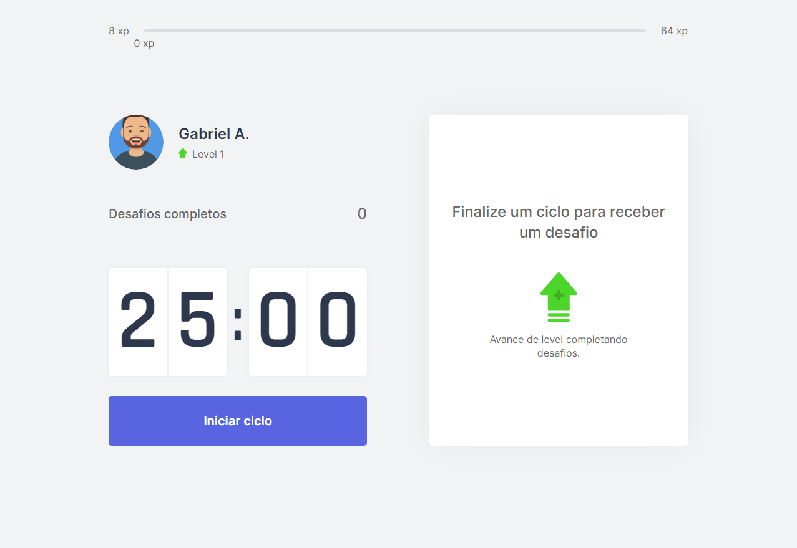

<div align="center">

  

</div>

<h1 align="center">Welcome to Move.it</h1>

<div align="center">

```typescript
console.log("🚀 Project Made in Next Level Week. Build with ❤️")
```

</div>

## 1. What's Is Move.it?

📖 Move.it is a pomodoro app where every 25 minutes of focus you release a different challenge, being able to earn xp for a complete challenge and even level up.

## 🎨 2. Design

<div align="center">



</div>

## 💻 3. Stack

- ReactJS
- Next.js
- TypeScript

## 💾 Clone

```sh
git clone https://github.com/korex71/moveit-nextjs
```

## 🗳 Install

```sh
yarn install
```

## 🚀 Usage

```sh
yarn dev
```

## Author

👤 **Kore**

* Website: https://moveit-korex71.vercel.app/
* Github: [@korex71](https://github.com/korex71)
